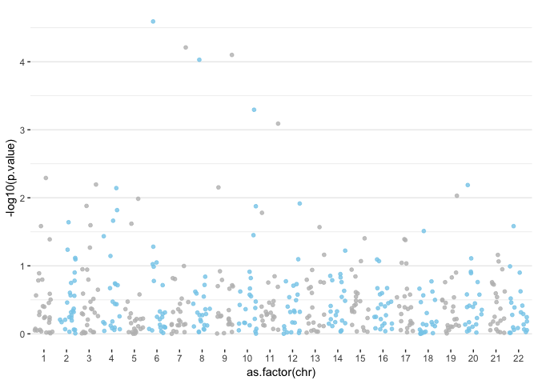
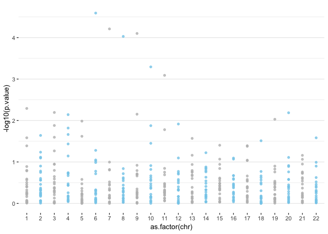

```r
# call library data.table
require(data.table)

# Set path function and the datasets are living in this online directory
path <- function(x) paste0("https://raw.githubusercontent.com/XUKEREN/rbootcamp-projects-17-gwas1/master/", x)

# Phenotype data
phenotype<-fread(path("phenodata.txt"))
head(phenotype)
```

```
##    fvcmax      age sex     PC1     PC2     PC3    PC4
## 1:   5.67 42.11362   1 -0.0014  0.0004 -0.0009 0.0084
## 2:   4.24 38.07255   1 -0.0028 -0.0009 -0.0011 0.0109
## 3:   4.78 38.04244   1 -0.0016 -0.0005  0.0012 0.0078
## 4:   6.77 39.55373   1 -0.0023 -0.0020 -0.0003 0.0107
## 5:   4.66 32.78850   1 -0.0026 -0.0018  0.0008 0.0086
## 6:   5.18 38.59822   1 -0.0028 -0.0004 -0.0006 0.0064
```

```r
# Genotypr data on chr1
head(fread(path("chr1.txt")))
```

```
##    rs442170 rs2116047 rs831535 rs11685451 rs7598215 rs17035943 rs7633386
## 1:        0         2        1          2         2          0         1
## 2:        0         1        1          2         2          0         1
## 3:        1         1        0          0         2          0         0
## 4:        0         2        1          2         2          0         0
## 5:        0         0        2          2         2          1         1
## 6:        1         1        2          2         1          0         0
##    rs2187352 rs1035798 rs861677 rs1283707 rs10827338 rs1876334 rs10997458
## 1:         0         1        2         1          2         1          0
## 2:         0         1        2         0          1         0          1
## 3:         2         1        1         0          1         1          1
## 4:         1         1        1         1          0         0          0
## 5:         1         0        2         1          2         0          2
## 6:         0         1        0         2          2         0          1
##    rs11202907 rs2046685 rs3782250 rs1438520 rs8033512 rs2165846 rs1617790
## 1:          2         1         1         2         2         1         2
## 2:          0         1         1         2         1         1         2
## 3:          0         0         1         2         2         0         2
## 4:          0         0         2         2         2         0         1
## 5:          1         0         2         2         0         1         2
## 6:          1         1         2         2         2         1         2
##    rs6025429 rs219762 rs9983786 rs399135 rs421549 rs16998436 rs2837220
## 1:         0        2         0        0        0          0         0
## 2:         0        2         1        1        0          0         1
## 3:         0        1         0        2        0          0         1
## 4:         0        2         0        0        0          0         0
## 5:         1        2         0        2        1          0         1
## 6:         0        2         0        1        0          0         1
```

```r
# Call dplyr library
library(dplyr)

# Set directory
getwd()
```

```
## [1] "/Users/XUKEREN/Desktop/Keren/content/post"
```

```r
setwd("/Users/XUKEREN/Desktop/rbootcamp/projects/17-gwas1")

# Read a list of genotype files
file.list<- list.files(getwd(), pattern="^chr.*.txt") %>%  # read file names
  sapply(read.table, simplify=FALSE) %>% # create a list of file
  lapply( `[`,1,) %>% # select the first row of each matrix in the list, which is the SNP row
  sapply(t) %>%  # transpose each matrix in the lsit
  sapply(data.frame, simplify=FALSE) # convert each matrix to dataframe

# Create a new variable "SNP" according to the file name
chrfile<-rbindlist(file.list,idcol="chr")[, chr := as.numeric(gsub("\\D", "", chr)) ]
colnames(chrfile)<-c("chr","SNP")
head(chrfile)
```

```
##    chr        SNP
## 1:   1   rs442170
## 2:   1  rs2116047
## 3:   1   rs831535
## 4:   1 rs11685451
## 5:   1  rs7598215
## 6:   1 rs17035943
```

```r
# Codes from Rbootcamp materials
#Loop to read the genotype data from each chromossome and run the regression analysis
regression.results<-c()

for(chr in 1:22){
  #Loading the genotype data
  genotype<-fread(paste('chr',chr,'.txt',sep=''))
  
  #Regression SNP-by-SNP (uses the apply function to be faster but can be done with a loop)
  regression<-t(apply(genotype,2,FUN=function(a){summary(lm(phenotype$fvcmax~a+phenotype$age+phenotype$sex+phenotype$PC1+phenotype$PC2+phenotype$PC3+phenotype$PC4))}$coef[2,]))
  
  #Final results with all the SNPs (n=500)
  regression.results<-rbind(regression.results,regression)
  
}

# Put rowname SNP as a variable
regression.results<-setDT(data.frame(regression.results), keep.rownames = TRUE)[]
# Set column name
colnames(regression.results)<-c("SNP", "Estimate","Std.Error","t.value","p.value")
head(regression.results)
```

```
##           SNP      Estimate  Std.Error     t.value    p.value
## 1:   rs442170  0.0219636985 0.03076713  0.71386885 0.47540906
## 2:  rs2116047  0.0346908973 0.02464979  1.40735039 0.15951152
## 3:   rs831535 -0.0005551698 0.02359770 -0.02352643 0.98123320
## 4: rs11685451 -0.0645659744 0.03153420 -2.04749054 0.04076771
## 5:  rs7598215  0.0076117896 0.04694117  0.16215593 0.87120289
## 6: rs17035943  0.0712679041 0.05118822  1.39227168 0.16402741
```

```r
# merge two dataset by SNP
masterfile <- merge(chrfile,regression.results,by="SNP")
head(masterfile)
```

```
##           SNP chr     Estimate  Std.Error     t.value    p.value
## 1:  rs1006265   3 -0.052024616 0.02323846 -2.23872901 0.02530618
## 2: rs10130236  22  0.245750561 0.23798544  1.03262854 0.30192882
## 3: rs10206130   5 -0.012599436 0.02431118 -0.51825687 0.60434842
## 4: rs10244048   6 -0.011676376 0.08406109 -0.13890346 0.88954335
## 5:  rs1024552   3 -0.018443417 0.02357513 -0.78232523 0.43413551
## 6:  rs1035798   1 -0.002266528 0.02581675 -0.08779293 0.93005189
```

```r
#Significantly associated SNPs (for alpha=0.05)
#Using Bonferroni correction
bonferroni<-0.05/500

# Create Manhattan plot

library(ggplot2)

ggplot(masterfile, aes(x=as.factor(chr), y=-log10(p.value))) +
  geom_jitter(aes(color=as.factor(chr)), alpha=0.8, size=1.3)+ # with jitter to avoid overlap
  scale_color_manual(values = rep(c("grey", "skyblue"), 22 )) +

  # Custom the theme:
  theme_bw() +
  theme( 
    legend.position="none",
    panel.border = element_blank(),
    panel.grid.major.x = element_blank(),
    panel.grid.minor.x = element_blank()
  )
```

<!-- -->

```r
# no jitter
ggplot(masterfile, aes(x=as.factor(chr), y=-log10(p.value))) +
  # Show all points
  geom_point( aes(color=as.factor(chr)), alpha=0.8, size=1.3) +
  scale_color_manual(values = rep(c("grey", "skyblue"), 22 )) +
  
  # Custom the theme:
  theme_bw() +
  theme( 
    legend.position="none",
    panel.border = element_blank(),
    panel.grid.major.x = element_blank(),
    panel.grid.minor.x = element_blank()
  )
```

<!-- -->

```r
library("CMplot")      #install.packages("CMplot")
CMplot(masterfile, plot.type="c", r=1.6, cir.legend=TRUE,
       outward=TRUE, cir.legend.col="black", cir.chr.h=.1 ,chr.den.col="orange", file="jpg",
       memo="", dpi=300, chr.labels=seq(1,22))+geom_jitter()
```

```
## [1] "Circular_Manhattan Plotting Std.Error..."
## [1] "Circular_Manhattan Plotting t.value..."
## [1] "Circular_Manhattan Plotting p.value..."
## [1] "Plots are stored in: /Users/XUKEREN/Desktop/rbootcamp/projects/17-gwas1"
```

```
## NULL
```
  

```r
CMplot(masterfile, plot.type="c", chr.labels=paste("chr",c(1:22),sep=""), r=0.4, cir.legend=TRUE,
       outward=FALSE, cir.legend.col="black", cir.chr.h=1.3 ,chr.den.col="black", file="jpg", memo="", dpi=300)
```

```
## [1] "Circular_Manhattan Plotting Std.Error..."
## [1] "Circular_Manhattan Plotting t.value..."
## [1] "Circular_Manhattan Plotting p.value..."
## [1] "Plots are stored in: /Users/XUKEREN/Desktop/Keren/content/post"
```
  


```r
library(plotly)

masterfile <- masterfile %>% mutate(is_highlight=ifelse(-log10(masterfile$p.value) > -log10(0.05/500), "yes", "no")) # add a variable to highlight significant SNP

# Interactive graph
# Prepare text description for each SNP:
masterfile$text <- paste("SNP: ", masterfile$SNP, "\nPosition: ", masterfile$chr, "\nLOD score:", -log10(masterfile$p.value) %>% round(2))

# Make the plot
p <- ggplot(masterfile, aes(x=chr, y=-log10(p.value), text=text)) +
  
  # Show all points
  geom_point( aes(color=as.factor(chr)), alpha=0.8, size=1.3) +
  scale_color_manual(values = rep(c("grey", "skyblue"), 22 )) +
  
  # Add highlighted points
  geom_point(data=subset(masterfile, is_highlight=="yes"), color="orange", size=2) +
  
  # Custom the theme:
  theme_bw() +
  theme( 
    legend.position="none",
    panel.border = element_blank(),
    panel.grid.major.x = element_blank(),
    panel.grid.minor.x = element_blank()
  )
ggplotly(p, tooltip="text")
```
see [here](http://xukeren.rbind.io/post/2018/08/19/rbootcamp-project-minigwas/) for the interactive graph

***
# References
* [USC Biostatistics Rbootcamp Project 17](https://github.com/USCbiostats/rbootcamp/tree/master/projects/17-gwas1)
* [Manhattan plot in R: a review
by Yan Holtz for the R graph gallery](https://www.r-graph-gallery.com/wp-content/uploads/2018/02/Manhattan_plot_in_R.html)
